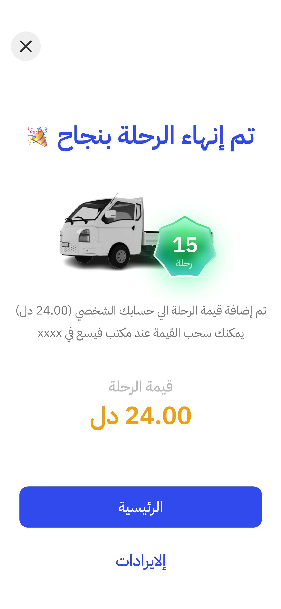

# Delivery App

A Flutter-based delivery app designed to provide towing and goods transportation services. The app consists of two main sections: one for users to request services, and another for drivers to manage their trips and service requests.

## Features

### User Section
- **Towing Service**:
    - Users can order towing services by selecting the location of the vehicle.
    - Displays the price of the towing service.
    - Tracks the location of the towing vehicle once the request is approved.
    - Users can view the history of their towing requests.

- **Transport of Goods**:
    - Users can request transportation of goods, specifying the type of goods and their weight.
    - Users provide receiver details and indicate if any work is required.
    - After the driver approves the request, users can track the transport of goods.

### Driver Section
- **Driver Profile**:
    - Drivers can upload images of their car, car number, and driving license for approval by the admin.

- **Trip Management**:
    - After admin approval, drivers can receive user requests for towing or goods transport.
    - Drivers can accept or cancel requests.
    - The app tracks the user's location, and drivers can open the location in Google Maps.
    - Drivers can view the history of their trips.

- **Automatic Money Calculation**:
    - The app automatically calculates the amount earned by the driver based on completed trips.
## User Screenshots

[//]: # (![Home Screen]&#40;assets/readme/1.jpg&#41;)


## Driver Screenshots

[//]: # (![Home Screen]&#40;assets/readme/1.jpg&#41;)




<
## Driver Screenshots


## Installation

### Prerequisites

1. Install Flutter on your machine:  
   [Flutter Installation Guide](https://flutter.dev/docs/get-started/install)

2. Set up an emulator or a physical device to test the app.

### Installing

1. Clone the repository:

   ```bash
   git clone https://github.com/a0Max/fissa.git

2. Navigate to the project directory:

   ```bash
   cd fissa
3. Install dependencies:

   ```bash
   flutter pub get
4. Run the app on an emulator or physical device:

   ```bash
   flutter run

